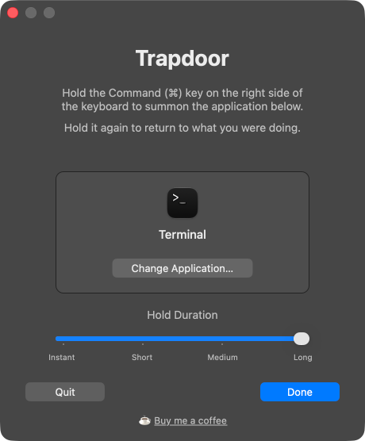

# Trapdoor

**Hold the Command (⌘) key on the right side of your keyboard to summon one chosen app — hold it again to drop back to whatever you were doing.**

Trapdoor isn't another app switcher, launcher, or palette. It doesn't try to replace ⌘-Tab, Mission Control, or Spotlight, and it doesn't pile on the features that tools like Raycast, Alfred, LaunchBar, rcmd, or Monarch already do well. It does exactly one thing: a single, dedicated key for the *one* app you reach for constantly.

There's nothing to launch, no fuzzy search, no list of shortcuts to memorize, and no chords. You pick the app once; after that it's pure muscle memory — like a push-to-talk button for your terminal, notes, or chat. It claims the otherwise-dead *gesture* of holding the right ⌘ key, so quick taps and normal right-⌘ shortcuts keep working exactly as before — you give up nothing.

It's tiny, instant, and stays out of the way: no Dock icon, no menu bar clutter, just one reflex that's always there.

## Download

**[Download the latest Trapdoor.dmg](https://github.com/grokcodile/trapdoor/releases/latest/download/Trapdoor.dmg)** — or see [all releases](https://github.com/grokcodile/trapdoor/releases/latest).

> This link always points to the most recent release build.

## Screenshot



## Features

- Hold right-⌘ to toggle a single chosen app in and out of focus.
- Works with **any** application, not just terminals.
- Adjustable **hold duration** (0–0.6s) so a normal press of right-⌘ is never hijacked.
- Correctly returns you to the previous app — including full-screen apps and apps with no open windows.
- Runs silently as a background agent (no Dock icon, no menu bar), and starts at login.

## Requirements

- macOS 13 or later.
- **Accessibility permission** (System Settings → Privacy & Security → Accessibility) so it can detect the right Command key.

## Build

```sh
bash install.sh
```

This compiles `main.swift`, generates the app icon from `trapdoor_icon.png`, ad-hoc code-signs, installs to `/Applications/Trapdoor.app`, and launches it. On first run, grant Accessibility permission when prompted.

> Optional: install [`pngquant`](https://pngquant.org) to shrink the generated icon.

## Releases

Pushing a version tag (e.g. `v1.0`) triggers the GitHub Actions release workflow
(`.github/workflows/release.yml`), which builds the app, packages a `.dmg`, and
attaches it to a GitHub Release.

```sh
git tag v1.0
git push origin v1.0
```

By default the `.dmg` is ad-hoc signed (other Macs will show a Gatekeeper
warning). To produce a signed + notarized build, add these repository secrets
(Settings → Secrets and variables → Actions) — the workflow detects them
automatically:

| Secret | Purpose |
| --- | --- |
| `MACOS_CERT_P12_BASE64` | Base64 of your exported **Developer ID Application** cert (`.p12`) |
| `MACOS_CERT_PASSWORD` | Password for that `.p12` |
| `AC_API_KEY_ID` | App Store Connect API **Key ID** |
| `AC_API_ISSUER_ID` | App Store Connect API **Issuer ID** |
| `AC_API_KEY_BASE64` | Base64 of the `AuthKey_XXXX.p8` |

## How it works

Trapdoor installs a `CGEventTap` that watches `flagsChanged` events for the right Command key (keycode 54). A sustained hold past the configured duration toggles the chosen app via `NSWorkspace`; full-screen and window-state edge cases are handled with the Accessibility API.

## Notes

This app uses a global event tap and controls other applications, which is incompatible with the Mac App Store sandbox — it's distributed directly (Developer ID + notarization, or built from source).

## License

Released under the [MIT License](LICENSE).
