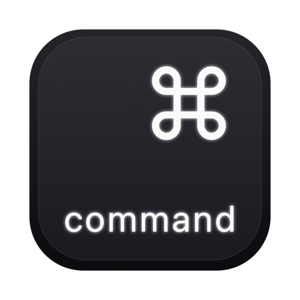

# Key54

*Your right-hand :keyboard:.*

**Hold the Command (:keyboard:) key on the right side of your keyboard to summon one chosen app — hold it again to switch back to whatever you were doing.**

Key54 isn't another app library switcher, launcher, or palette. It doesn't try to replace :keyboard:-Tab, Mission Control, or Spotlight, and it doesn't pile on the features that tools like Raycast, Alfred, LaunchBar, rcmd, or Monarch already do well. It does exactly one thing: a single, dedicated key for the *one* app you reach for constantly.

There's nothing to launch, no fuzzy search, no list of shortcuts to memorize, and no chords. You pick the app once; after that it's pure muscle memory — like a push-to-talk button for your terminal, notes, browser, or chat. It claims the otherwise-dead *gesture* of holding the right :keyboard: key, so quick taps and normal right-:keyboard: shortcuts keep working exactly as before (unless you opt into the Instant preset) — you give up nothing.

And it's calm by design. Instead of racing to :keyboard:-Tab across your desktop and back, you hold the key and it charges for a beat before it fires — a small, deliberate pause that lets your brain settle into the switch (dial it to Instant if you'd rather skip it). One key, one app, no chord to remember: a context switch that gives you a moment to breathe.

It's fast, tiny (~1 MB download), uses almost zero system resources, and stays out of the way: no Dock icon, no menu bar clutter.

## Screenshot


## Download

**Download the latest [Key54.dmg](https://github.com/grokcodile/key54/releases/latest/download/Key54.dmg) — or see [all releases](https://github.com/grokcodile/key54/releases).** *This link always points to the most recent release build.*

Open the `.dmg` and drag **Key54** into your `Applications` folder.

> **Apple Silicon only.** The released build is arm64; it won't run on Intel Macs. Intel users can [build from source](#build).
>
> **First launch:** the build isn't notarized yet, so macOS will warn that it's from an unidentified developer. You only need to clear this once, in any of these ways:
>
> - **macOS 13–14:** right-click (or Control-click) **Key54 → Open**, then click **Open** in the dialog.
> - **macOS 15 (Sequoia) and later:** double-click it (it gets blocked), then go to **System Settings → Privacy & Security**, scroll down, and click **Open Anyway**.
> - **Terminal (any version):** `xattr -dr com.apple.quarantine /Applications/Key54.app`
>
> Prefer no warning at all? [Build from source](#build) — a locally built app isn't quarantined and just runs.

## Features

- Hold right-:keyboard: to toggle a single chosen app in and out of focus.
- **One key, held — no chord.** No :keyboard:-key combination, no rapid tapping, no sequence to remember; just hold one key. Pure muscle memory, and a gentler reach than :keyboard:-Space or :keyboard:-Tab (see [Accessibility](#accessibility)).
- Works with **any** application of your choice.
- **Hold Duration presets** (Instant / Short / Medium / Long / Custom) with a built-in **Key Delay**, so a quick press or normal right-:keyboard: shortcut is never hijacked. **Instant** skips the animation entirely and switches the moment you press; **Custom** lets you tune the timings yourself.
- A subtle **charge animation** plays as you hold and dissolves as it switches, on a Liquid Glass bezel (macOS 26+; frosted glass on older systems). Pick from two [Animation Styles](#animation-style) — **Power Up** (a glowing ring) or **Level Up** (a filling level) — both following the accent color you've chosen in System Settings.
- Correctly returns you to the previous app — including full-screen apps and apps with no open windows.
- Runs silently as a background agent (no Dock icon, no menu bar), and starts at login.

## Usage Examples

Pick the one app you're *always* dropping into and back out of, bind it with Key54, and forget the keyboard gymnastics.

- **Developer** — bind the terminal of your choice (Terminal.app, Warp, Ghostty, iTerm). It's one key away from anywhere: `brew install` something mid-task, check a deploy script, fire off a quick `git` command — then one key back to what you were doing. And it's the **full app**, with all its tabs and sessions, not a stripped-down dropdown drawer, global hotkey window, or limited notch gimmick.

- **Researcher** — bind your browser (Safari, Chrome, Arc). Reading a doc or writing something and need to look a thing up? One tap brings the real browsing session forward, one tap returns to the work — no new window, no "search the web" box.

- **Note Taker** — bind your favorite notes app (Notes, Obsidian, Bear). A thought worth capturing never means hunting for the right window: one tap to the notebook, jot it down, one tap back. The capture friction basically disappears.

- **Manager** — bind your email or chat client (Mail, Messages, Slack). Glance at a message and reply, then drop straight back into focus — without getting sucked in and losing the thread of deeper work.

Whatever you assign as your **Key54**, the pattern is the same: **summon → do the thing → dismiss** — without ever breaking stride or wondering which shortcut to press.

## Accessibility

Key54 needs only a **single key, held** — the right :keyboard: key on its own, no multi-finger chord, no rapid tapping, no sequence to remember. For anyone who finds combinations like :keyboard:-Space or :keyboard:-Tab hard to reach or hold, holding one key to bring an app forward — and holding it again to go back — can be a genuinely simpler way to move between apps.

The timing is forgiving, too: a quick or accidental press does nothing, and you can let go any time before the animation fills to cancel. Key54 was built as a convenience, but the same no-chord, no-reach interaction turns out to be an accessibility aid — and honestly, a little easier for everyone.

## Hold Duration

The slider in settings controls how long you hold the right :keyboard: key before the switch fires — and how much ceremony comes with it. Short, Medium, and Long each start with a brief **Key Delay** (nothing appears yet, and letting go does nothing), followed by the charge animation you can watch fill. Release any time before it completes and the switch is cancelled.

| Preset | Hold to trigger | Behavior |
| --- | --- | --- |
| **Instant** | A press — no hold | Completely hands the right :keyboard: key to Key54: no hold, no delay, no animation — the moment you press, you've switched. Quick taps and right-:keyboard: shortcuts trigger it too, so pick this only if you're dedicating the key. |
| **Short** | ~0.5 s | A snappy switch that still leaves normal right-:keyboard: shortcuts usable — anything shorter than the half-second Key Delay is ignored. No charge animation; the app's icon simply appears and dissolves into the switch. |
| **Medium** *(default)* | ~0.9 s (0.5 s Key Delay + 0.4 s animation) | The best mix: enough delay to cancel the switch early just by letting go, a smooth transition that supports a more graceful mental shift between tasks, and still quick and responsive. |
| **Long** | ~1.3 s (0.7 s Key Delay + 0.6 s animation) | An even more generous, deliberate task-switching experience — maximum time to watch it fill and change your mind. |
| **Custom** | Your call — up to 1.5 s + 1.5 s | Build your own: **Key Delay** and **Animation Length** sliders appear in a panel below, adjustable in 0.05 s steps — and your values are remembered, even while trying other presets. A zero Animation Length gives Short's icon-only flash; zero both and it behaves like Instant. |

## Animation Style

Pick how the hold is visualized while it charges. It only affects the presets that actually animate (Short / Medium / Long / Custom), and both styles follow your System Settings accent color on the Liquid Glass bezel:

- **Power Up** — the chosen app's icon inside a glowing accent ring that sweeps to full as you hold. Minimal and quick to read.
- **Level Up** — a larger icon over a glass that fills with your accent color (with a soft glow at the surface) as you hold, like a level meter topping off. A touch more playful, and easy to read at a glance.

## Requirements

- macOS 13 or later.
- **Apple Silicon** — the released `.dmg` is arm64-only. (Intel Macs can build from source.)
- **Accessibility permission** (System Settings → Privacy & Security → Accessibility) so it can detect the right Command key.

## Build

```sh
bash install.sh
```

This compiles `main.swift`, generates the app icon (`make_icon.swift`), ad-hoc code-signs, installs to `/Applications/Key54.app`, and launches it. On first run, grant Accessibility permission when prompted.

> Optional: install [`pngquant`](https://pngquant.org) to shrink the generated icon.

## First run

1. Launch **Key54** from `Applications`. Its window opens.
2. Grant **Accessibility** permission when prompted — System Settings → Privacy & Security → Accessibility → enable Key54. This lets it detect the right Command key.
3. Click **Change Application…** and pick the app you want bound to the right :keyboard: key.
4. Optionally pick a **Hold Duration** preset (how long you hold before it triggers) — or choose **Custom** and dial in your own timings — and an **Animation Style** (Power Up or Level Up).
5. Click **Done**. Key54 keeps running in the background (and starts automatically at login).

To change the app or settings later, just open Key54 again from `Applications`.


## Uninstall

1. Quit Key54 (open it and click **Quit**, or `killall Key54`).
2. Drag **Key54** from `Applications` to the Trash. This also removes its login item.
3. Optionally remove its entry under System Settings → Privacy & Security → Accessibility.

## Releases

Pushing a version tag (e.g. `v1.0`) triggers the GitHub Actions release workflow
(`.github/workflows/release.yml`), which builds the app, packages a `.dmg`, and
attaches it to a GitHub Release.

```sh
git tag v1.0
git push origin v1.0
```

By default the `.dmg` is ad-hoc signed (other Macs will show a Gatekeeper
warning). To produce a signed + notarized build, add these repository secrets
(Settings → Secrets and variables → Actions) — the workflow detects them
automatically:

| Secret | Purpose |
| --- | --- |
| `MACOS_CERT_P12_BASE64` | Base64 of your exported **Developer ID Application** cert (`.p12`) |
| `MACOS_CERT_PASSWORD` | Password for that `.p12` |
| `AC_API_KEY_ID` | App Store Connect API **Key ID** |
| `AC_API_ISSUER_ID` | App Store Connect API **Issuer ID** |
| `AC_API_KEY_BASE64` | Base64 of the `AuthKey_XXXX.p8` |

## How it works

Key54 installs a `CGEventTap` that watches `flagsChanged` events for the right Command key (keycode 54). A sustained hold past the configured duration toggles the chosen app via `NSWorkspace`; full-screen and window-state edge cases are handled with the Accessibility API.

## The name

**54** is the macOS keycode for the right Command key — the exact key this app
claims. (You can see it in the source: the event tap watches for `keycode 54`.)
So **Key54** is literally that — the key, named by its number; the app's whole
job written as a coordinate.


## Notes

This app uses a global event tap and controls other applications, which is incompatible with the Mac App Store sandbox — it's distributed directly (Developer ID + notarization, or built from source).

## Tip Jar

Key54 is free and open source. If it earns a spot on your Mac, please support its development:

- :coffee: [Buy me a coffee on Ko-fi](https://ko-fi.com/grokcodile)
- :heart: [Sponsor me on GitHub](https://github.com/sponsors/grokcodile)

## License

Released under the [MIT License](LICENSE).
