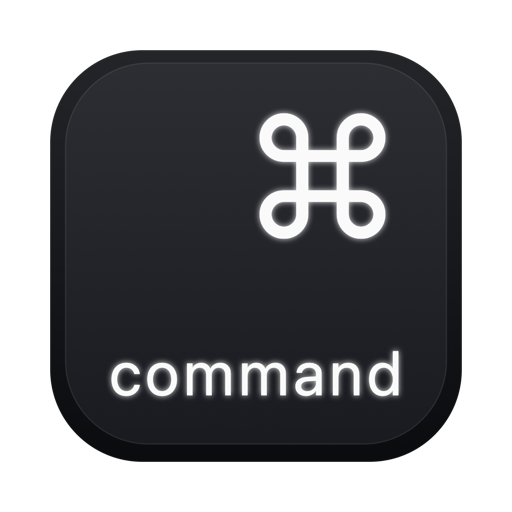
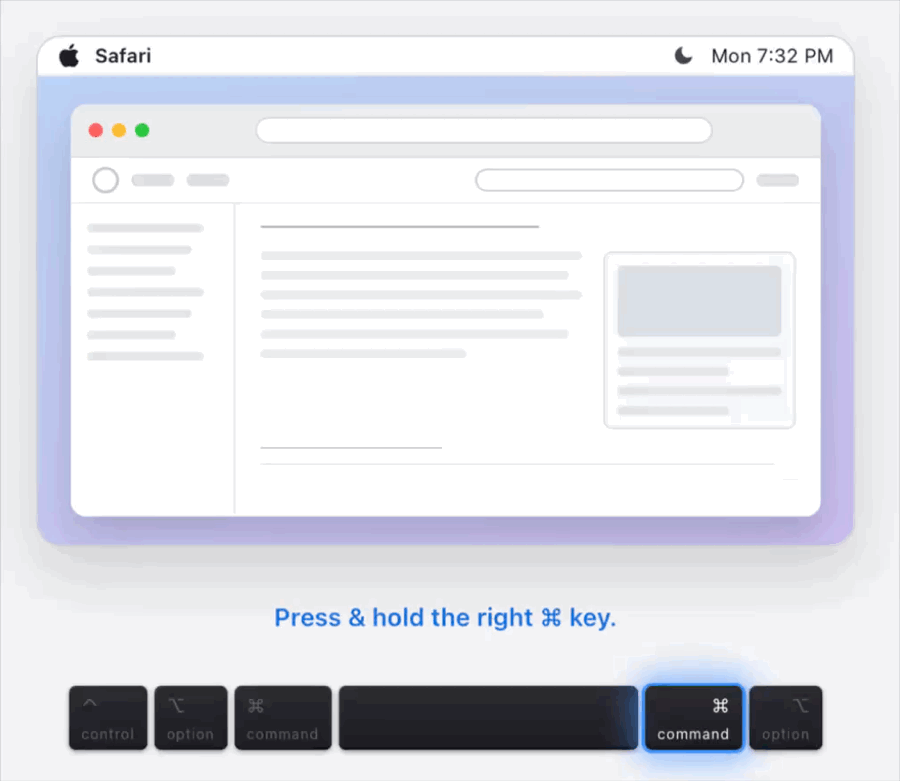

# Key54

[](https://github.com/grokcodile/key54/releases/latest)
[](https://github.com/grokcodile/homebrew-tap)
[](https://github.com/grokcodile/key54/releases)
[](#requirements)
[](LICENSE)

**Key54** is a tiny macOS utility that binds one app of your choice to the right Command key (keycode 54). Hold the right ⌘ to summon that app; hold it again to switch back to what you were doing. A built-in hold delay keeps quick taps and your normal right-⌘ shortcuts working as usual.

It runs as a background agent — no Dock icon, no menu bar item — and starts at login.

<p align="center">
  
</p>

<p>
  <a href="https://key54.app"></a>
</p>

## Features

- Hold right-⌘ to toggle one chosen app in and out of focus; hold again to return.
- Works with any application.
- **Hold Duration** presets (Instant / Short / Medium / Long / Custom) with a built-in Key Delay, so quick taps and normal right-⌘ shortcuts aren't hijacked.
- A charge animation on a Liquid Glass bezel, in two styles — **Power Up** and **Level Up** — following your System Settings accent color.
- Correctly returns you to the previous app, including full-screen apps and apps with no open windows.
- Runs silently as a background agent and starts at login.

## Screenshot


## Install

### Homebrew (easiest — also handles updates)

```sh
brew install --cask grokcodile/tap/key54
```

New versions arrive with `brew upgrade --cask key54`.

### Download the disk image

1. Download the latest **[Key54.dmg](https://github.com/grokcodile/key54/releases/latest/download/Key54.dmg)** (or browse [all releases](https://github.com/grokcodile/key54/releases)).
2. Open the `.dmg` and drag **Key54** into your `Applications` folder.

Key54 is signed and notarized by Apple, so it opens normally — no "unidentified developer" warning. macOS may show a one-time "downloaded from the Internet" confirmation; just click **Open**.

> **Apple Silicon, macOS 26 or later.**

### Updates

Key54 checks for a new release when you open it and each time you open its settings. It never checks in the background while you work: when it starts at login it checks once, and shows its window only if there's an update waiting.

When one is available, an **Update** button appears in the settings window. A Homebrew install upgrades and reopens on the new version by itself. A disk-image install downloads the new `.dmg`, opens it, and quits so you can drag the new version over the old one.

That update check is the only network request Key54 makes — see [PRIVACY.md](PRIVACY.md).

### Build from source

On an Apple Silicon Mac with macOS 26 and Apple's command-line tools (`xcode-select --install`):

```sh
bash install.sh
```

This builds Key54, installs it to `/Applications` and launches it.

## Requirements

- **macOS 26 or later**, on an **Apple Silicon** Mac.
- **Accessibility permission** (System Settings → Privacy & Security → Accessibility) so it can detect the right Command key.

## First run

1. Launch **Key54** from `Applications`. Its window opens.
2. Grant **Accessibility** when macOS asks on first launch — that's what lets Key54 detect the right Command key. If you dismiss the prompt, the **System Permissions** readout under the switch shows Accessibility in red; click it to ask again, or turn Key54 on yourself under System Settings → Privacy & Security → Accessibility.
3. Click **Change Application…** and pick the app you want bound to the right ⌘ key.
4. Optionally pick a **Hold Duration** preset (how long you hold before it triggers) — or choose **Custom** and dial in your own timings — and an **Animation Style** (Power Up or Level Up).
5. Click **Done**. Key54 keeps running in the background (and starts automatically at login).

To change the app or settings later, just open Key54 again from `Applications`.

## Hold Duration

The slider in settings controls how long you hold the right ⌘ key before the switch fires — and how much ceremony comes with it. Short, Medium, and Long each start with a brief **Key Delay** (nothing appears yet, and letting go does nothing), followed by the charge animation you can watch fill. Release any time before it completes and the switch is cancelled.

| Preset | Hold to trigger | Behavior |
| --- | --- | --- |
| **Instant** | A press — no hold | Completely hands the right ⌘ key to Key54: no hold, no delay, no animation — the moment you press, you've switched. Quick taps and right-⌘ shortcuts trigger it too, so pick this only if you're dedicating the key. |
| **Short** | ~0.5 s | A snappy switch that still leaves normal right-⌘ shortcuts usable — anything shorter than the half-second Key Delay is ignored. No charge animation; the app's icon simply appears and dissolves into the switch. |
| **Medium** *(default)* | ~0.9 s (0.5 s Key Delay + 0.4 s animation) | The best mix: enough delay to cancel the switch early just by letting go, a smooth transition, and still quick and responsive. |
| **Long** | ~1.3 s (0.7 s Key Delay + 0.6 s animation) | A more generous, deliberate task-switch — maximum time to watch it fill and change your mind. |
| **Custom** | Your call — up to 1.5 s + 1.5 s | Build your own: **Key Delay** and **Animation Length** sliders appear in a panel below, adjustable in 0.05 s steps — and your values are remembered, even while trying other presets. A zero Animation Length gives Short's icon-only flash; zero both and it behaves like Instant. |

## Animation Style

Pick how the hold is visualized while it charges. It only affects the presets that actually animate (Medium / Long / Custom — Instant and Short skip the charge entirely), and both styles follow your System Settings accent color on the Liquid Glass bezel:

- **Power Up** — the chosen app's icon inside a glowing accent ring that sweeps to full as you hold.
- **Level Up** — a larger icon over a glass that fills with your accent color as you hold, like a level meter topping off.

## Uninstall

1. Open Key54, toggle the switch to **Disabled** (this removes the login item), then click **Quit**. (Or just `killall Key54`.)
2. Drag **Key54** from `Applications` to the Trash.
3. Optionally remove its entry under System Settings → Privacy & Security → Accessibility.

Installed with Homebrew, steps 1 and 2 are `brew uninstall --cask key54`; add `--zap` to remove its preferences too.

## How it works

Key54 watches for the right Command key with a **listen-only** event tap. It only observes key events — it never intercepts, delays or changes them — so your typing and shortcuts pass straight through, even if Accessibility is switched off while it's running. It keeps seeing the key during Space switches and full-screen transitions, so the trigger works whichever app or Space is in front.

When you hold past your Hold Duration, Key54 brings your chosen app forward, or returns you to the app you were in. Full-screen apps and apps with no open windows are handled through the Accessibility API, so you land back exactly where you were.

## The name

**54** is the macOS keycode for the right Command key — the exact key this app claims. So **Key54** is literally that: the key, named by its number.

## Why it isn't on the Mac App Store

Key54 watches the keyboard and switches between other apps, which the App Store's sandbox doesn't allow. It's distributed directly instead — signed and notarized by Apple.

## License

Released under the [MIT License](LICENSE).

## Author

Built by **Ethan Darling** — [@grokcodile](https://github.com/grokcodile) on GitHub · [u/grokcodile](https://www.reddit.com/user/grokcodile) on Reddit · [LinkedIn](https://www.linkedin.com/in/ethandarling/). Feedback and bug reports welcome: [key54@ethans.email](mailto:key54@ethans.email).
